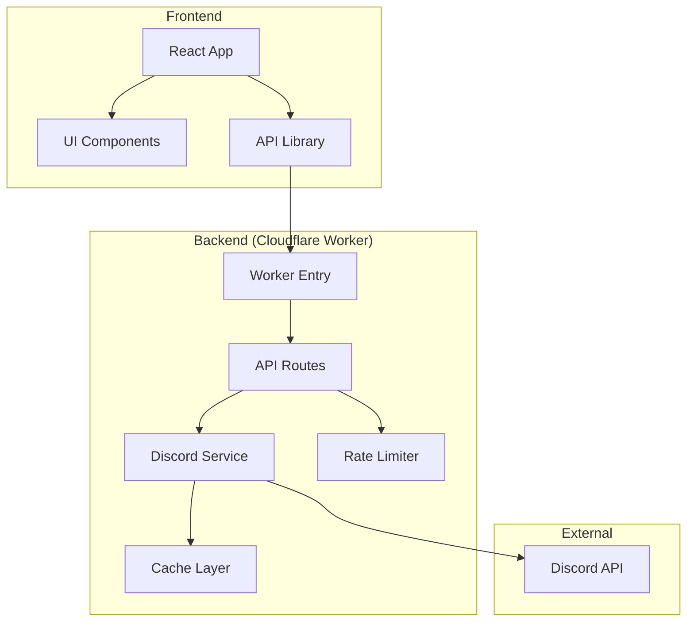
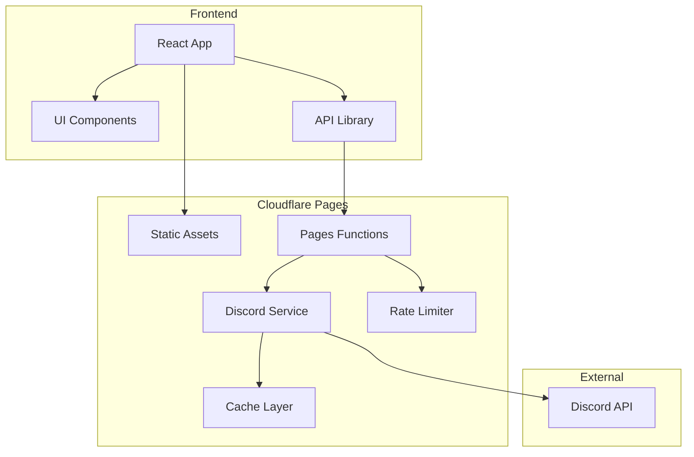
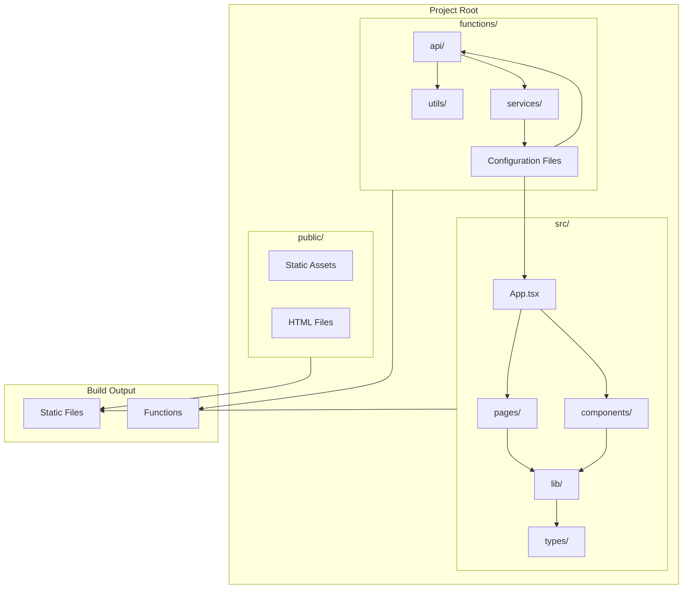

# System Patterns

## Architecture Overview
[High-level description of system architecture]

## Design Patterns
[List and explain key design patterns in use]

## Component Structure
[Describe major components and their relationships]

Current Structure:

Target Structure (After Migration):

Detailed Project Structure After Migration:

## Data Flow
[Explain how data flows through the system]

## Key Technical Decisions
- [Decision 1 + rationale]
- [Decision 2 + rationale]

## System Constraints
[Document any technical limitations or constraints] 